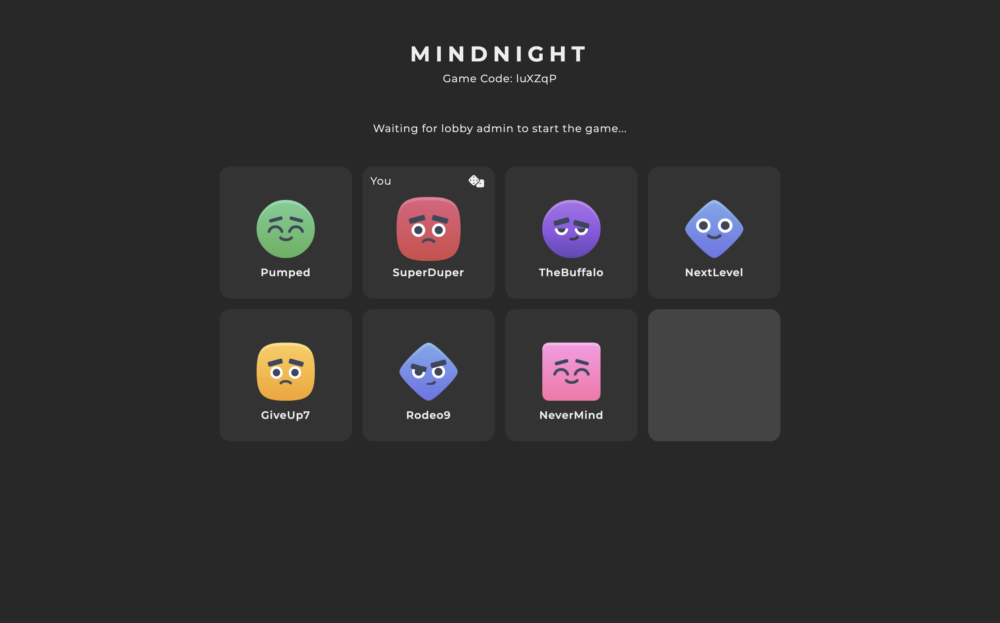

    <h1>Mindnight</h1>
    
A website where you can play the game mindnight against your friends online

    
<i>A preview of how the game looks</i>

## Overview

This is an implementation of the board game mindnight that you can spin up and play with your friends. The frontend uses React and the backend is written in nodejs. Routing is managed by [nginx](https://nginx.org/en/).

## How to play mindnight

Mindnight is a logic deduction game where some people need to use deduction, lying and decive to win the game.

The game starts by assigning all player a role, hacker or agent. The roles are hidden to all agents, but the hackers knows what role everyone has.
The goal of the game is to win sets called missions, the first team to win 3 missions out of 5 win the game.

The game is divided into 3 phases, proposal, vote on proposal and mission.

In the proposal phase the first player proposes a number of players to be on the mission.
The amount of players needed to be proposed depends on which round it is.
The proposing player can propose anyone even themselves.

After a proposal has been made every player needs to vote on the proposal.
You either accept that the players should go on the mission or reject.
If **atleast** 50% of players accept the proposal the proposed players move on to the mission stage.
If the proposal is reject the next player in line get's to propose a team and the game continues form the first phase

In the mission stage the proposed players get to choose how the mission goes.
They can either hack or fulfill the mission.
If **any** player hacks the mission the mission fails, otherwise the mission is successful.
The amount of players that hacked the misison will be shown to all players, but how the individual players voted will be hidden for everyone.
After the mission is finished the next player in line will get to propose a team and the game coninues from the proposal phase.

## Running locally

The entire project can be run with [docker compose](https://docs.docker.com/compose/). Just run `docker compose up` in the root of the project. You need to set the PORT env variable to the port you want the server to use.
